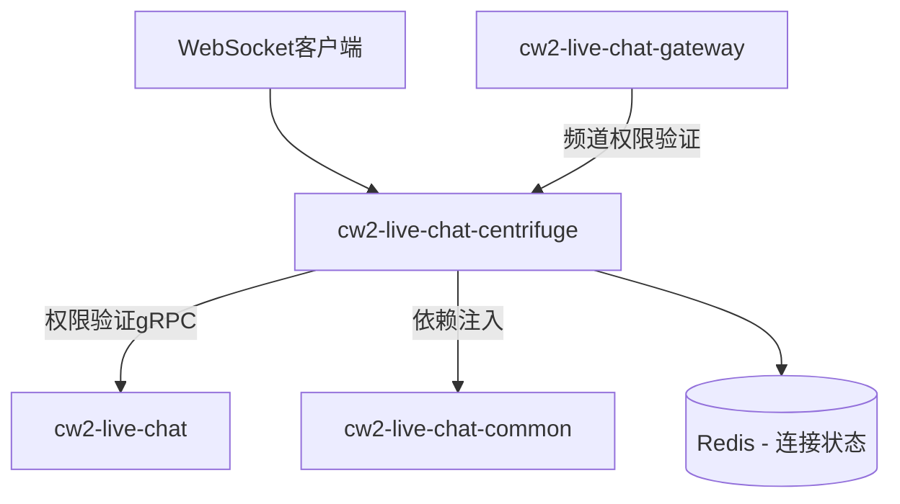

# CLAUDE.md - cw2-live-chat-centrifuge 实时通信引擎

This file provides guidance to Claude Code (claude.ai/code) when working with the cw2-live-chat-centrifuge real-time communication engine.

> LiveChat实时通信引擎开发指南  
> **版本**: v2.2  
> **更新时间**: 2025-08-08  
> **适用范围**: cw2-live-chat-centrifuge实时通信引擎（CentrifugeAdvanced双层架构 + 实时权限验证优化）

## 📋 目录

1. [项目架构理解](#1-项目架构理解)
2. [CentrifugeAdvanced双层架构](#2-centrifugeadvanced双层架构)
3. [实时权限验证系统](#3-实时权限验证系统)
4. [WebSocket连接管理](#4-websocket连接管理)
5. [频道订阅和权限控制](#5-频道订阅和权限控制)
6. [开发规范和最佳实践](#6-开发规范和最佳实践)
7. [常见问题和解决方案](#7-常见问题和解决方案)
8. [实时通信开发工作流程](#8-实时通信开发工作流程)
9. [快速参考](#9-快速参考)

---

## 1. 项目架构理解

### 1.1 服务职责定位

**cw2-live-chat-centrifuge服务**: 实时通信引擎，负责：
- WebSocket连接管理和维持
- 实时消息推送和频道管理
- 连接状态同步和在线状态维护
- 实时权限验证优化（性能层，调用live-chat统一权限）
- 服务器端订阅和零信任认证

### 1.2 实时通信交互模式



### 1.3 相关子项目文档

- **业务服务**: [backend/cw2-live-chat/CLAUDE.md](../../backend/cw2-live-chat/CLAUDE.md)
- **API网关**: [backend/cw2-live-chat-gateway/CLAUDE.md](../../backend/cw2-live-chat-gateway/CLAUDE.md)
- **共享组件**: [pkg/cw2-live-chat-common/CLAUDE.md](../cw2-live-chat-common/CLAUDE.md)

---

## 2. CentrifugeAdvanced双层架构

### 2.1 双层架构设计

**CentrifugeAdvanced配置**: 双层架构设计，包含传输层和业务层：

- **Centrifuge (传输层)**: 基础WebSocket连接、消息传输、协议处理
- **CentrifugeAdvanced (业务层)**: 业务逻辑增强、权限验证、连接状态管理

### 2.2 架构组件划分

```
pkg/cw2-live-chat-centrifuge/
├── internal/
│   ├── centrifuge/              # 传输层 - 基础Centrifuge功能
│   │   ├── server.go                # Centrifuge服务器
│   │   ├── connection_manager.go    # 连接管理
│   │   └── message_handler.go       # 消息处理
│   ├── advanced/                # 业务层 - CentrifugeAdvanced功能
│   │   ├── permission/              # 实时权限验证
│   │   ├── subscription/            # 服务器端订阅管理
│   │   ├── presence/                # 在线状态管理
│   │   └── auth/                    # 零信任认证
│   └── config/
│       └── centrifuge_config.go     # 双层配置管理
```

### 2.3 CentrifugeAdvanced配置详解

#### **重要澄清**: CentrifugeAdvanced.permissionValidation不是独立权限系统

**正确理解**:
```yaml
# ✅ 正确理解：性能优化层
centrifugeAdvanced:
  permissionValidation:
    enabled: true              # 启用实时权限验证优化
    cacheEnabled: true         # 启用本地权限缓存
    batchValidationSize: 20    # 批量验证优化
    fallbackToLiveChat: true   # 缓存未命中时调用live-chat
    cacheTimeout: "5m"         # 本地缓存超时
    
  serverSideSubscription:
    enabled: true              # 启用服务器端订阅
    maxSubscriptionsPerUser: 100
    
  connectionStateSync:
    enabled: true              # 启用连接状态同步
    syncInterval: "30s"        # 状态同步间隔
    
  zeroTrustAuth:
    enabled: true              # 启用零信任认证
    tokenRefreshInterval: "15m" # Token刷新间隔
```

**错误理解**:
```yaml  
# ❌ 错误理解：独立权限系统
centrifugeAdvanced:
  permissionValidation:
    enabled: true  # 以为是另一套独立的权限系统
```

---

## 3. 实时权限验证系统

### 3.1 权限验证原理

**核心原则**: CentrifugeAdvanced权限验证是live-chat统一权限系统的**性能优化层**，不是独立权限系统。

### 3.2 权限验证架构

```go
// pkg/cw2-live-chat-centrifuge/internal/advanced/permission/validator.go
type CentrifugePermissionValidator struct {
    localCache               *permission.LocalPermissionCache
    liveChatPermissionClient livechat.PermissionServiceClient
    config                   *config.PermissionValidationConfig
}

func (v *CentrifugePermissionValidator) ValidateChannelAccess(ctx context.Context, userID, channelID string) bool {
    // 1. 检查本地缓存（性能优化）
    if cached := v.localCache.Get(userID, channelID); cached != nil {
        return cached.Allowed
    }
    
    // 2. 调用live-chat统一权限管理器（权威决策）
    result, err := v.liveChatPermissionClient.ValidateChannelPermission(ctx, &permission.ValidateChannelPermissionRequest{
        UserId:    userID,
        UserType:  v.getUserType(userID), // B或C用户类型
        Channel:   channelID,
        Operation: "subscribe",
        Context:   v.buildContext(ctx),   // 构建上下文信息
    })
    
    if err != nil {
        zaplog.GetGlobalLogger().ErrorWithCtx(ctx, "频道权限检查失败: %v", err)
        return false
    }
    
    // 3. 缓存结果（性能优化，但不影响权威性）
    cacheResult := &CachedPermissionResult{
        Allowed:   result.HasPermission,
        Reason:    result.Reason,
        ExpiresAt: time.Now().Add(5 * time.Minute),
    }
    v.localCache.Set(userID, channelID, cacheResult)
    
    zaplog.DebugLogWithCtxFormat(ctx, "频道权限验证完成: user_id=%s, channel=%s, allowed=%t, from_cache=%t",
        userID, channelID, result.HasPermission, result.FromCache)
    
    return result.HasPermission
}
```

### 3.3 批量权限验证优化

```go
// 批量频道权限验证（实时消息优化）
func (v *CentrifugePermissionValidator) BatchValidateChannelAccess(ctx context.Context, userID string, channelIDs []string) map[string]bool {
    // 构建批量请求
    channelPairs := make([]*permission.ChannelOperationPair, len(channelIDs))
    for i, channelID := range channelIDs {
        channelPairs[i] = &permission.ChannelOperationPair{
            Channel:   channelID,
            Operation: "subscribe",
        }
    }
    
    result, err := v.liveChatPermissionClient.BatchValidateChannelPermissions(ctx, &permission.BatchValidateChannelPermissionsRequest{
        UserId:      userID,
        UserType:    v.getUserType(userID),
        Channels:    channelPairs,
        EnableCache: true,
        Context:     v.buildContext(ctx),
    })
    
    if err != nil {
        zaplog.GetGlobalLogger().ErrorWithCtx(ctx, "批量频道权限检查失败: %v", err)
        return make(map[string]bool) // 失败时拒绝所有访问
    }
    
    permissions := make(map[string]bool)
    for channel, perm := range result.Results {
        permissions[channel] = perm.HasPermission
        
        // 缓存各个结果
        if !perm.FromCache {
            cacheResult := &CachedPermissionResult{
                Allowed:   perm.HasPermission,
                Reason:    perm.Reason,
                ExpiresAt: time.Now().Add(5 * time.Minute),
            }
            v.localCache.Set(userID, channel, cacheResult)
        }
    }
    
    return permissions
}
```

---

## 4. WebSocket连接管理

### 4.1 连接生命周期管理

```go
// pkg/cw2-live-chat-centrifuge/internal/centrifuge/connection_manager.go
type ConnectionManager struct {
    connections sync.Map // map[string]*Connection
    centrifuge  *centrifuge.Node
    authService *auth.AuthService
}

func (cm *ConnectionManager) HandleConnection(client *centrifuge.Client) {
    // 1. 连接建立时的认证
    client.OnConnect(func(e centrifuge.ConnectEvent) (centrifuge.ConnectReply, error) {
        // 零信任认证
        userID, err := cm.authService.AuthenticateConnection(e.Token)
        if err != nil {
            return centrifuge.ConnectReply{}, centrifuge.DisconnectInvalidToken
        }
        
        // 注册连接
        connection := &Connection{
            UserID:    userID,
            Client:    client,
            ConnectAt: time.Now(),
        }
        cm.connections.Store(client.ID(), connection)
        
        return centrifuge.ConnectReply{
            Data: []byte(`{"status":"connected"}`),
        }, nil
    })
    
    // 2. 连接断开时的清理
    client.OnDisconnect(func(e centrifuge.DisconnectEvent) {
        cm.connections.Delete(client.ID())
        zaplog.GetGlobalLogger().InfoWithCtxFormat(context.Background(), "用户连接断开: client_id=%s", client.ID())
    })
}
```

### 4.2 连接状态同步

```go
// 连接状态同步到Redis
func (cm *ConnectionManager) syncConnectionState(ctx context.Context) {
    ticker := time.NewTicker(30 * time.Second)
    defer ticker.Stop()
    
    for {
        select {
        case <-ticker.C:
            cm.syncToRedis(ctx)
        case <-ctx.Done():
            return
        }
    }
}

func (cm *ConnectionManager) syncToRedis(ctx context.Context) {
    onlineUsers := make([]string, 0)
    cm.connections.Range(func(key, value interface{}) bool {
        if conn, ok := value.(*Connection); ok {
            onlineUsers = append(onlineUsers, conn.UserID)
        }
        return true
    })
    
    // 同步在线状态到Redis
    err := cm.presenceService.UpdateOnlineUsers(ctx, onlineUsers)
    if err != nil {
        zaplog.GetGlobalLogger().ErrorWithCtx(ctx, "同步在线状态失败: %v", err)
    }
}
```

---

## 5. 频道订阅和权限控制

### 5.1 服务器端订阅管理

```go
// pkg/cw2-live-chat-centrifuge/internal/advanced/subscription/manager.go
type SubscriptionManager struct {
    permissionValidator *permission.CentrifugePermissionValidator
    centrifuge         *centrifuge.Node
}

func (sm *SubscriptionManager) HandleSubscribe(client *centrifuge.Client) {
    client.OnSubscribe(func(e centrifuge.SubscribeEvent) (centrifuge.SubscribeReply, error) {
        // 1. 获取用户ID
        userID := sm.getUserIDFromClient(client)
        
        // 2. 权限验证（调用live-chat统一权限系统）
        if !sm.permissionValidator.ValidateChannelAccess(e.Context, userID, e.Channel) {
            return centrifuge.SubscribeReply{}, centrifuge.ErrorPermissionDenied
        }
        
        // 3. 记录订阅
        zaplog.GetGlobalLogger().InfoWithCtxFormat(e.Context, "用户订阅频道: user_id=%s, channel=%s", userID, e.Channel)
        
        return centrifuge.SubscribeReply{
            Options: centrifuge.SubscribeOptions{
                EnablePositionSync: true,
                EnableRecovery:     true,
                RecoveryMode:      centrifuge.RecoveryModeStream,
            },
        }, nil
    })
}
```

### 5.2 频道权限策略

```go
// 频道命名规范和权限映射
func (sm *SubscriptionManager) buildChannelPermissionContext(userID, channel string) map[string]interface{} {
    context := make(map[string]interface{})
    
    // 解析频道类型
    if strings.HasPrefix(channel, "conversation:") {
        conversationID := strings.TrimPrefix(channel, "conversation:")
        context["resource_type"] = "conversation"
        context["resource_id"] = conversationID
        context["action"] = "subscribe"
        
    } else if strings.HasPrefix(channel, "shop:") {
        shopID := strings.TrimPrefix(channel, "shop:")
        context["resource_type"] = "shop"
        context["resource_id"] = shopID
        context["action"] = "subscribe"
        
    } else if strings.HasPrefix(channel, "user:") {
        targetUserID := strings.TrimPrefix(channel, "user:")
        context["resource_type"] = "user_channel"
        context["resource_id"] = targetUserID
        context["action"] = "subscribe"
    }
    
    context["requester_user_id"] = userID
    return context
}
```

---

## 6. 开发规范和最佳实践

### 6.1 必须使用的工具库

**Centrifuge特定工具库**:
- **实时通信**: Centrifuge官方Go SDK （必须使用指定版本）
- **配置管理**: `configx.BaseConfig` （统一配置结构）
- **日志记录**: `pkg/zaplog` （禁止使用标准log包）
- **缓存操作**: `pkg/storage/three_cache` （连接状态缓存）
- **并发控制**: `concurrency.SafeGo` （禁止直接 `go func()`）

### 6.2 正确使用示例

**WebSocket消息处理**:
```go
// ✅ 正确 - Centrifuge消息处理
func (h *MessageHandler) HandleMessage(client *centrifuge.Client) {
    client.OnMessage(func(e centrifuge.MessageEvent) {
        // 使用SafeGo处理异步消息
        concurrency.SafeGo(func() {
            h.processMessage(e.Context, client, e.Data)
        })
    })
}
```

**配置管理**:
```go
// ✅ 正确 - Centrifuge配置结构
import "github.com/channelwill/cw2-live-chat-common/configx"

type CentrifugeConfig struct {
    configx.BaseConfig
    Centrifuge        CentrifugeNodeConfig     `yaml:"centrifuge"`
    CentrifugeAdvanced CentrifugeAdvancedConfig `yaml:"centrifuge_advanced"`
}
```

---

## 7. 常见问题和解决方案

### 7.1 权限验证性能问题

#### ❌ 常见错误
```go
// ❌ 每次都调用live-chat权限服务
func (v *Validator) checkPermission(userID, channel string) bool {
    result, _ := v.liveChatClient.CheckPermission(ctx, req)
    return result.Allowed
}
```

#### ✅ 正确做法
```go
// ✅ 使用本地缓存优化
func (v *CentrifugePermissionValidator) ValidateChannelAccess(ctx context.Context, userID, channelID string) bool {
    // 先检查缓存
    if cached := v.localCache.Get(userID, channelID); cached != nil {
        return cached.Allowed
    }
    
    // 缓存未命中才调用live-chat
    // ... 权威权限检查和缓存更新
}
```

### 7.2 连接状态不同步

#### ❌ 常见错误
```go
// ❌ 没有定期同步连接状态
func (cm *ConnectionManager) addConnection(client *centrifuge.Client) {
    cm.connections.Store(client.ID(), client) // 只存储本地
}
```

#### ✅ 正确做法  
```go
// ✅ 定期同步到Redis
func (cm *ConnectionManager) startConnectionSync(ctx context.Context) {
    ticker := time.NewTicker(30 * time.Second)
    go func() {
        for {
            select {
            case <-ticker.C:
                cm.syncConnectionState(ctx)
            case <-ctx.Done():
                return
            }
        }
    }()
}
```

### 7.3 频道命名不规范

#### ❌ 常见错误
```go
// ❌ 随意的频道命名
channel := "chat_" + conversationID
channel := userID + "_notifications"
```

#### ✅ 正确做法
```go
// ✅ 标准化频道命名规范
const (
    ConversationChannelPrefix = "conversation:"
    ShopChannelPrefix         = "shop:"
    UserChannelPrefix         = "user:"
)

func BuildConversationChannel(conversationID string) string {
    return ConversationChannelPrefix + conversationID
}
```

---

## 8. 实时通信开发工作流程

### 8.1 新频道类型开发流程

**步骤1: 定义频道命名规范**
```go
// 在常量中定义新的频道类型
const (
    OrderChannelPrefix = "order:"  // 订单频道
)

func BuildOrderChannel(orderID string) string {
    return OrderChannelPrefix + orderID
}
```

**步骤2: 配置权限验证规则**
```go
// 在权限上下文构建中添加新频道类型处理
func (sm *SubscriptionManager) buildChannelPermissionContext(userID, channel string) map[string]interface{} {
    // ... 现有频道类型处理 ...
    
    if strings.HasPrefix(channel, "order:") {
        orderID := strings.TrimPrefix(channel, "order:")
        context["resource_type"] = "order"
        context["resource_id"] = orderID
        context["action"] = "subscribe"
    }
    
    return context
}
```

**步骤3: 实现消息推送逻辑**
```go
// 实现订单频道的消息推送
func (p *OrderMessagePusher) PushOrderUpdate(ctx context.Context, orderID string, update *OrderUpdate) error {
    channel := BuildOrderChannel(orderID)
    
    data, err := json.Marshal(update)
    if err != nil {
        return err
    }
    
    // 推送消息到频道
    _, err = p.centrifuge.Publish(channel, data)
    return err
}
```

### 8.2 测试和部署

```bash
# 构建Centrifuge服务
cd pkg/cw2-live-chat-centrifuge && make build

# 运行单元测试
cd pkg/cw2-live-chat-centrifuge && make test

# 运行WebSocket连接测试
cd pkg/cw2-live-chat-centrifuge && make test-websocket
```

---

## 9. 快速参考

### 9.1 常用命令
```bash
# 构建Centrifuge服务
cd pkg/cw2-live-chat-centrifuge && make build

# 运行Centrifuge服务
cd pkg/cw2-live-chat-centrifuge && make run

# 测试WebSocket连接
cd pkg/cw2-live-chat-centrifuge && make test-connection

# 查看在线连接状态
curl http://localhost:8080/centrifuge/info
```

### 9.2 重要路径
```bash
# Centrifuge核心服务
pkg/cw2-live-chat-centrifuge/internal/centrifuge/server.go

# 权限验证器
pkg/cw2-live-chat-centrifuge/internal/advanced/permission/validator.go

# 连接管理器
pkg/cw2-live-chat-centrifuge/internal/centrifuge/connection_manager.go

# 配置文件
pkg/cw2-live-chat-centrifuge/configs/base.yaml
```

### 9.3 频道命名规范
```go
// 标准频道命名前缀
const (
    ConversationChannelPrefix = "conversation:"  // 会话频道
    ShopChannelPrefix         = "shop:"          // 店铺频道  
    UserChannelPrefix         = "user:"          // 用户频道
    OrderChannelPrefix        = "order:"         // 订单频道
    SystemChannelPrefix       = "system:"        // 系统频道
)
```

### 9.4 权限验证配置
```yaml
centrifugeAdvanced:
  permissionValidation:
    enabled: true
    cacheEnabled: true
    batchValidationSize: 20
    fallbackToLiveChat: true
    cacheTimeout: "5m"
    
  performance:
    maxConnectionsPerUser: 10      # 单用户最大连接数
    messageRateLimit: 100          # 消息速率限制（条/分钟）
    subscriptionLimit: 50          # 单连接最大订阅数
```

---

**📚 相关文档**:
- [业务服务](../../backend/cw2-live-chat/CLAUDE.md)
- [API网关](../../backend/cw2-live-chat-gateway/CLAUDE.md)  
- [共享组件](../cw2-live-chat-common/CLAUDE.md)
- [项目总览](../../CLAUDE.md)

**🔄 文档更新**: 本指南专注于cw2-live-chat-centrifuge服务的实时通信开发，随项目演进持续更新。