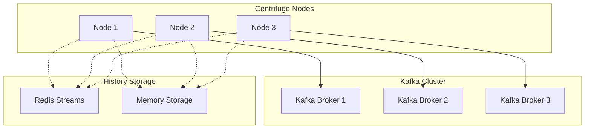
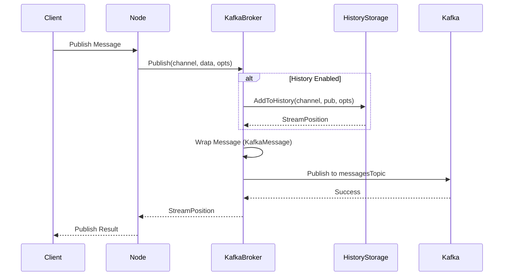
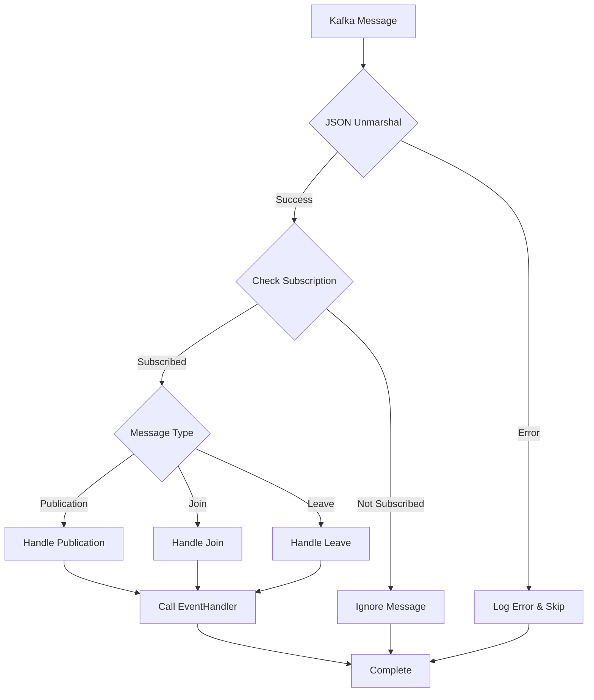

# Kafka Broker 实现原理文档

本文档详细描述了基于 Kafka 的 Centrifuge Broker 实现原理、架构设计和核心机制。

## 📋 目录

- [1. 总体架构](#1-总体架构)
- [2. 核心组件](#2-核心组件)
- [3. 消息流转机制](#3-消息流转机制)
- [4. 历史存储设计](#4-历史存储设计)
- [5. 订阅管理机制](#5-订阅管理机制)
- [6. 错误处理和重试](#6-错误处理和重试)
- [7. 性能优化设计](#7-性能优化设计)
- [8. 与 Redis Broker 对比](#8-与-redis-broker-对比)

## 1. 总体架构

### 1.1 架构概览



### 1.2 设计原则

| 原则             | 实现方式                      | 优势                         |
| ---------------- | ----------------------------- | ---------------------------- |
| **消息隔离**     | 统一 topic + 消息类型路由     | 减少 Kafka 连接数，提高性能  |
| **分布式一致性** | 可插拔历史存储接口            | 支持 Redis/Memory 等多种存储 |
| **高可用性**     | 基于 Common 包的 Kafka 客户端 | 自动重连、错误重试           |
| **可观测性**     | 完整的日志和监控接口          | 便于运维和问题排查           |

## 2. 核心组件

### 2.1 组件关系图

```go
// 核心组件结构
type KafkaBroker struct {
    node           *Node                    // Centrifuge 节点引用
    config         KafkaBrokerConfig        // 配置信息
    kafkaBroker    commonBroker.Broker      // Common 包 Kafka 客户端
    eventHandler   BrokerEventHandler       // 事件处理器
    subscriptions  sync.Map                 // 订阅管理：map[string]bool
    historyStorage HistoryStorage           // 历史存储接口
    
    // Topic 管理
    messagesTopic  string                   // 统一消息 topic
    
    // 订阅状态管理
    subscriptionMu     sync.RWMutex         // 订阅锁
    isSubscribed       bool                 // 全局订阅状态
    subscribedChannels map[string]bool      // 已订阅 channel 列表
    
    // 生命周期管理
    closeOnce      sync.Once               // 确保只关闭一次
    stopCh         chan struct{}           // 停止信号
}
```

### 2.2 配置组件

```go
type KafkaBrokerConfig struct {
    // Kafka 配置 - 直接使用 Common 包
    KafkaConfig gkafka.KafkaConfig
    
    // Centrifuge 特有配置
    TopicPrefix     string           // Topic 前缀，默认 "centrifuge"
    ConsumerGroupID string           // 消费者组 ID
    Name           string           // Broker 名称，用于日志和监控
    
    // 历史存储配置
    HistoryStorage HistoryStorage   // 可插拔的历史存储
    
    // 性能配置
    NumPartitions  int              // Topic 分区数，默认 1
}
```

## 3. 消息流转机制

### 3.1 消息统一化设计

**关键创新**：所有消息类型都通过单一 Kafka Topic 传输，使用消息包装器进行类型区分。

```go
// 消息包装器
type KafkaMessage struct {
    Type           MessageType    `json:"type"`            // 消息类型
    Channel        string         `json:"channel"`         // 目标 channel
    Data           []byte         `json:"data"`            // 消息数据 (protobuf)
    StreamPosition StreamPosition `json:"stream_position,omitempty"` // 流位置信息
}

// 消息类型定义
const (
    MessageTypePublication MessageType = iota  // 普通消息
    MessageTypeJoin                           // 用户加入
    MessageTypeLeave                          // 用户离开
)
```

### 3.2 发布流程



**关键代码**：
```go
func (b *KafkaBroker) Publish(ch string, data []byte, opts PublishOptions) (StreamPosition, bool, error) {
    // 1. 创建 protobuf 消息
    protoPub := &protocol.Publication{
        Data: data,
        Info: infoToProto(opts.ClientInfo),
        Tags: opts.Tags,
        Time: time.Now().UnixMilli(),
    }

    // 2. 处理历史存储（如果启用）
    var sp StreamPosition
    if opts.HistorySize > 0 && opts.HistoryTTL > 0 {
        publication := pubFromProto(protoPub)
        sp, err = b.historyStorage.AddToHistory(context.Background(), ch, publication, opts)
        if err != nil {
            return StreamPosition{}, false, fmt.Errorf("failed to add to history: %w", err)
        }
    }

    // 3. 包装消息
    msgWrapper := KafkaMessage{
        Type:           MessageTypePublication,
        Channel:        ch,
        Data:           byteMessage,
        StreamPosition: sp,
    }

    // 4. 发布到 Kafka (使用 channel 作为分区键)
    err = b.kafkaBroker.Publish(
        context.Background(),
        b.messagesTopic,
        msgData,
        commonBroker.WithPublishName(ch), // 分区键
    )

    return sp, false, err
}
```

### 3.3 消费处理流程



**统一消息处理器**：
```go
func (b *KafkaBroker) handleMessage(ctx context.Context, data []byte) error {
    // 1. 解析消息包装器
    var msgWrapper KafkaMessage
    if err := json.Unmarshal(data, &msgWrapper); err != nil {
        return err
    }

    // 2. 检查订阅状态
    if _, subscribed := b.subscriptions.Load(msgWrapper.Channel); !subscribed {
        return nil // 忽略未订阅的 channel
    }

    // 3. 根据消息类型路由
    switch msgWrapper.Type {
    case MessageTypePublication:
        return b.handlePublication(msgWrapper)
    case MessageTypeJoin:
        return b.handleJoin(msgWrapper)
    case MessageTypeLeave:
        return b.handleLeave(msgWrapper)
    default:
        return fmt.Errorf("unknown message type: %d", msgWrapper.Type)
    }
}
```

## 4. 历史存储设计

### 4.1 可插拔存储架构

```go
// 历史存储接口
type HistoryStorage interface {
    AddToHistory(ctx context.Context, channel string, pub *Publication, opts PublishOptions) (StreamPosition, error)
    GetHistory(ctx context.Context, channel string, opts HistoryOptions) ([]*Publication, StreamPosition, error)
    RemoveHistory(ctx context.Context, channel string) error
}
```

### 4.2 存储实现对比

| 存储类型                 | 适用场景             | 优势                         | 劣势                     |
| ------------------------ | -------------------- | ---------------------------- | ------------------------ |
| **MemoryHistoryStorage** | 单节点部署、测试环境 | 极快的读写速度               | 重启丢失、无法分布式共享 |
| **RedisHistoryStorage**  | 分布式生产环境       | 持久化、分布式共享、TTL 支持 | 网络延迟、内存成本       |

### 4.3 Redis 存储原理

**核心设计**：使用 Redis Streams + Hash 的组合存储模式

```redis
# 消息存储 (Redis Stream)
XADD livechat:history:stream:chat:room:123 * data <protobuf-data>

# 元数据存储 (Redis Hash)
HSET livechat:history:meta:chat:room:123 epoch "abc123-1609459200" updated_at 1609459200

# TTL 管理
EXPIRE livechat:history:stream:chat:room:123 3600
EXPIRE livechat:history:meta:chat:room:123 3600
```

**查询优化**：
```go
// 支持高效的范围查询
func (r *RedisHistoryStorage) GetHistory(ctx context.Context, channel string, opts HistoryOptions) ([]*Publication, StreamPosition, error) {
    // 构建查询参数
    start, end, count := r.buildRangeArgs(opts.Filter, currentPos)
    
    // 执行范围查询
    if opts.Filter.Reverse {
        streamResults, err = r.client.XRevRangeN(ctx, streamKey, end, start, int64(count)).Result()
    } else {
        streamResults, err = r.client.XRangeN(ctx, streamKey, start, end, int64(count)).Result()
    }
    
    // 转换为 Publication 对象
    return r.parseStreamMessages(streamResults), currentPos, nil
}
```

## 5. 订阅管理机制

### 5.1 订阅架构
- 全局单一消费者监听统一 topic
- 应用层路由到具体 channel

```go
// 订阅机制
// N 个 channels = 1 个 Kafka consumer + 内存路由表

func (b *KafkaBroker) Subscribe(ch string) error {
    // 只需要标记订阅状态，不创建新的 Kafka 消费者
    b.subscriptions.Store(ch, true)
    
    b.subscriptionMu.Lock()
    b.subscribedChannels[ch] = true
    b.subscriptionMu.Unlock()
    
    return nil
}
```

### 5.2 全局消费者启动

```go
func (b *KafkaBroker) startGlobalConsumer() error {
    go func() {
        for {
            select {
            case <-b.stopCh:
                return
            default:
                err := b.kafkaBroker.Subscribe(
                    context.Background(),
                    b.messagesTopic,
                    b.config.ConsumerGroupID,
                    b.handleMessage,               // 统一消息处理器
                    commonBroker.WithSubPullGoroutines(2),
                    commonBroker.WithEnableSubUseMsgBuffer(),
                    commonBroker.WithSubMsgBufferSize(1024),
                    commonBroker.WithSubMsgBufferGoroutines(4),
                )
                
                if err != nil {
                    // 自动重试逻辑
                    time.Sleep(5 * time.Second)
                    continue
                }
            }
        }
    }()
    
    return nil
}
```

## 6. 错误处理和重试

### 6.1 多层次错误处理

```go
// 1. Kafka 连接级错误处理
func (b *KafkaBroker) startGlobalConsumer() error {
    go func() {
        for {
            select {
            case <-b.stopCh:
                return
            default:
                err := b.kafkaBroker.Subscribe(...)
                if err != nil {
                    b.node.logger.log(newErrorLogEntry(err, "kafka broker global consumer failed", map[string]any{
                        "topic":       b.messagesTopic,
                        "broker_name": b.config.Name,
                    }))
                    // 指数退避重试
                    select {
                    case <-b.stopCh:
                        return
                    case <-time.After(5 * time.Second):
                        continue
                    }
                }
            }
        }
    }()
}

// 2. 消息处理级错误处理
func (b *KafkaBroker) handleMessage(ctx context.Context, data []byte) error {
    var msgWrapper KafkaMessage
    if err := json.Unmarshal(data, &msgWrapper); err != nil {
        // 记录错误但不中断消费
        b.node.logger.log(newErrorLogEntry(err, "failed to unmarshal kafka message", nil))
        return nil // 返回 nil 继续处理下一条消息
    }
    
    // 消息路由错误处理
    switch msgWrapper.Type {
    case MessageTypePublication:
        if err := b.handlePublication(msgWrapper); err != nil {
            b.node.logger.log(newErrorLogEntry(err, "failed to handle publication", map[string]any{
                "channel": msgWrapper.Channel,
            }))
        }
    }
    return nil
}
```

### 6.2 历史存储错误处理

```go
func (b *KafkaBroker) Publish(ch string, data []byte, opts PublishOptions) (StreamPosition, bool, error) {
    var sp StreamPosition
    if opts.HistorySize > 0 && opts.HistoryTTL > 0 {
        publication := pubFromProto(protoPub)
        sp, err = b.historyStorage.AddToHistory(context.Background(), ch, publication, opts)
        if err != nil {
            // 历史存储失败时的处理策略
            b.node.logger.log(newErrorLogEntry(err, "failed to add to history", map[string]any{
                "channel": ch,
            }))
            
            // 可以选择：
            // 1. 继续发布消息，只记录错误
            // 2. 失败整个发布操作
            // 这里选择策略 1，保证消息的实时性
        }
    }
    
    // 继续 Kafka 发布流程...
}
```

## 7. 性能优化设计

### 7.1 消息批处理优化

```go
// 使用 Common 包的批处理配置
err := b.kafkaBroker.Subscribe(
    context.Background(),
    b.messagesTopic,
    b.config.ConsumerGroupID,
    b.handleMessage,
    commonBroker.WithSubPullGoroutines(2),        // 2 个拉取协程
    commonBroker.WithEnableSubUseMsgBuffer(),     // 启用消息缓冲
    commonBroker.WithSubMsgBufferSize(1024),      // 缓冲区大小 1024
    commonBroker.WithSubMsgBufferGoroutines(4),   // 4 个处理协程
)
```

### 7.2 分区策略优化

```go
// 使用 channel 名称作为分区键，确保同一 channel 的消息有序
err = b.kafkaBroker.Publish(
    context.Background(),
    b.messagesTopic,
    msgData,
    commonBroker.WithPublishName(ch), // channel 作为分区键
)
```

### 7.3 内存使用优化

```go
// 订阅状态使用 sync.Map，支持高并发读写
type KafkaBroker struct {
    subscriptions sync.Map // map[string]bool - 无锁读写
    
    // 避免频繁的 map 操作
    subscriptionMu     sync.RWMutex
    subscribedChannels map[string]bool // 批量操作时使用
}
```

## 8. 与 Redis Broker 对比

### 8.1 特性对比表

| 特性           | Kafka Broker                | Redis Broker       |
| -------------- | --------------------------- | ------------------ |
| **消息持久化** | ✅ 原生支持，可配置保留策略  | ❌ 纯内存，重启丢失 |
| **分布式扩展** | ✅ 原生分区和副本支持        | ✅ 通过 Redis 集群  |
| **消息顺序**   | ✅ 分区内保证顺序            | ✅ 发布顺序保证     |
| **历史消息**   | ✅ 可插拔存储 (Redis/Memory) | ✅ 内存存储         |
| **性能**       | 🟡 毫秒级延迟                | 🟢 微秒级延迟       |
| **运维复杂度** | 🟡 Kafka 集群管理            | 🟢 Redis 相对简单   |
| **消息积压**   | ✅ 可处理大量积压            | ❌ 受内存限制       |
| **多语言支持** | ✅ 丰富的客户端库            | ✅ 丰富的客户端库   |

### 8.2 使用场景建议

**选择 Kafka Broker 的场景**：
- ✅ 需要消息持久化和高可靠性
- ✅ 大规模分布式部署
- ✅ 消息吞吐量要求高
- ✅ 需要消息审计和回溯
- ✅ 已有 Kafka 基础设施

**选择 Redis Broker 的场景**：
- ✅ 对延迟极其敏感
- ✅ 中小规模部署
- ✅ 运维资源有限
- ✅ 已有 Redis 基础设施
- ✅ 消息临时性，无持久化需求

### 8.3 性能数据对比

| 指标         | Kafka Broker      | Redis Broker    |
| ------------ | ----------------- | --------------- |
| **发布延迟** | 1-5ms             | 0.1-1ms         |
| **消费延迟** | 1-10ms            | 0.1-1ms         |
| **吞吐量**   | 100K+ msg/s       | 50K+ msg/s      |
| **内存使用** | 较低 (主要在磁盘) | 较高 (全内存)   |
| **CPU 使用** | 中等              | 较低            |
| **网络带宽** | 较高 (消息较大)   | 较低 (消息较小) |

## 总结

Kafka Broker 是为分布式、高可靠性场景设计的企业级解决方案，具备以下核心优势：

### 🏗️ **架构优势**
- **统一消息流**：单一 topic 处理所有消息类型，大幅减少资源消耗
- **可插拔存储**：支持 Redis/Memory 多种历史存储方案

### 🚀 **性能优势**  
- **批处理**：消息缓冲和批量处理
- **分区策略**：基于 channel 的智能分区

### 🛡️ **可靠性优势**
- **自动重试**：多层次错误处理和恢复
- **优雅降级**：历史存储失败不影响实时消息
- **监控完备**：详细的日志和性能指标

